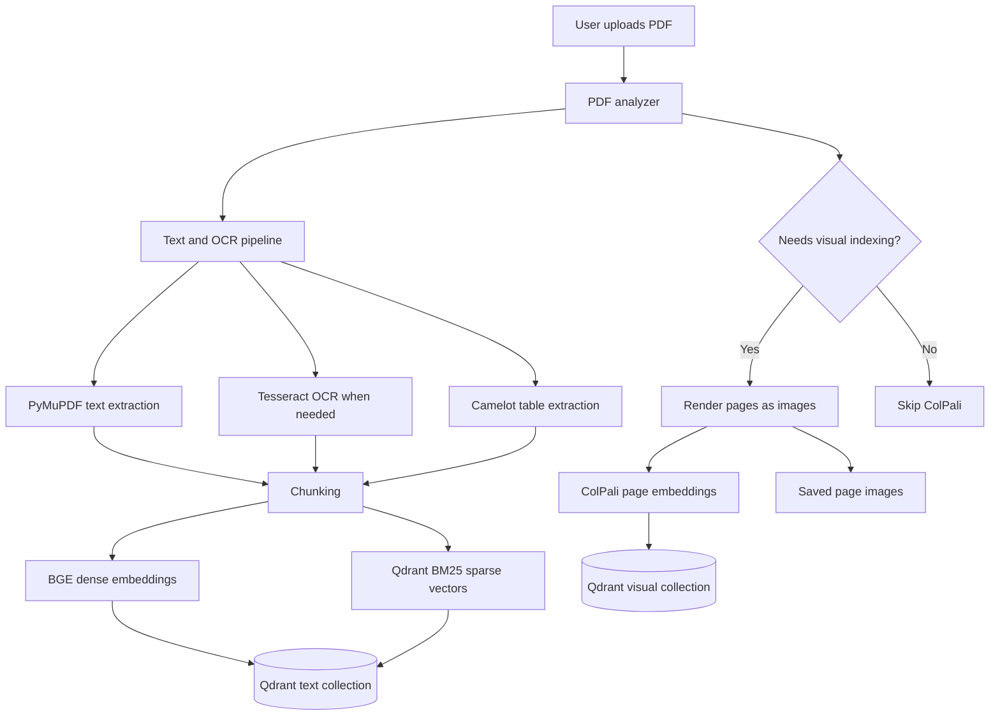
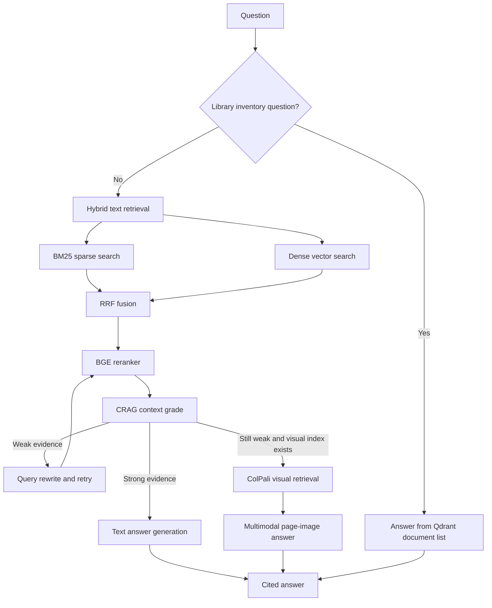

# Retriva

Retriva is a self-correcting hybrid document RAG system for PDFs.

It ingests normal text PDFs, scanned PDFs, tables, forms, charts, and visual
page layouts, then answers questions with grounded citations. The interface
stays simple: upload documents, search your library, ask questions, and inspect
the evidence when needed.

```text
Upload PDFs -> Retriva indexes the right evidence -> Ask questions -> Get cited answers
```

## Why Retriva Exists

Most document QA systems work well only when the PDF is clean text. Real PDFs
are messier. They contain scanned pages, forms, score cards, screenshots,
tables, charts, signatures, stamps, and layouts where the answer may be visible
but not available as clean text.

Retriva handles that by combining:

- text extraction
- OCR
- table parsing
- dense vector retrieval
- BM25 sparse retrieval
- reciprocal rank fusion
- BGE reranking
- CRAG-style self-correction
- ColPali visual page retrieval
- multimodal answer generation
- Ragas-style evaluation

The goal is not to expose all of that complexity to the user. The goal is to
make the system choose the right evidence path automatically.

## Current Capabilities

| Area | What Retriva Does |
| --- | --- |
| PDF ingestion | Repairs uploaded PDFs, extracts text, OCRs scanned pages, and extracts tables. |
| Hybrid retrieval | Searches Qdrant with dense BGE vectors and sparse BM25 vectors. |
| Fusion | Combines sparse and dense results with reciprocal rank fusion. |
| Reranking | Uses a BGE reranker to select the strongest final chunks. |
| Self-correction | Grades retrieved context and rewrites weak queries before answering. |
| Visual retrieval | Uses ColPali when a document is scanned, image-heavy, low-text, or layout-heavy. |
| Multimodal QA | Sends retrieved page images to a vision-capable OpenRouter model when needed. |
| Citations | Produces inline citations and keeps full source details in a collapsed panel. |
| Library | Shows indexed Qdrant documents in a searchable sidebar library. |
| Evaluation | Logs queries to SQLite and computes faithfulness, relevancy, precision, and recall. |
| Timing logs | Prints per-stage timings so latency bottlenecks are visible. |

## User Experience

Retriva is designed around a few simple actions.

1. Upload a PDF.
2. Click `Ingest document`.
3. Search the sidebar library to see what is indexed.
4. Ask a question.
5. Read the answer.
6. Open `Answer details` only when you want sources, retrieval path, grades, or evidence.

The sidebar library is backed by Qdrant, not just Streamlit session state. If
you refresh the page or restart Streamlit, indexed documents still show as long
as they exist in Qdrant.

## Architecture



At query time:



## Automatic Visual Detection

Retriva does not ask the user to choose between text and visual retrieval.

During ingestion, `backend/ingestion/pdf_analyzer.py` inspects the PDF for:

- low text density
- scanned or image-like pages
- meaningful embedded images
- drawing-heavy or layout-heavy pages

Then `VISUAL_INDEX_MODE` controls the decision:

```env
VISUAL_INDEX_MODE=auto
```

Supported values:

| Value | Behavior |
| --- | --- |
| `auto` | Use ColPali only when the PDF appears to need visual indexing. |
| `always` | Always index every PDF with ColPali. |
| `never` | Disable visual indexing. |

Useful visual thresholds:

```env
VISUAL_MIN_TEXT_CHARS_PER_PAGE=120
VISUAL_MIN_IMAGE_AREA_RATIO=0.15
```

## Retrieval Stack

Retriva stores text chunks in Qdrant with two vector types:

- dense BGE embedding vectors
- sparse Qdrant BM25 vectors

At query time, it retrieves from both paths, fuses the results, and reranks the
best candidates:

```text
BM25 top results + dense top results -> RRF -> BGE reranker -> final chunks
```

The reranker is intentionally kept in the pipeline because it is a major quality
layer. For practical CPU latency, the default lightweight reranker is:

```env
RERANKER_MODEL=BAAI/bge-reranker-base
RERANKER_USE_FP16=false
```

If you have a strong GPU and want a larger model, you can switch back to:

```env
RERANKER_MODEL=BAAI/bge-reranker-v2-m3
RERANKER_USE_FP16=true
```

## Self-Correction

Retriva includes a simple CRAG-style correction loop:

1. Retrieve with the original query.
2. Rerank candidate chunks.
3. Ask the LLM to grade whether the context answers the question.
4. If weak, rewrite the query.
5. Retrieve and rerank again.

Configuration:

```env
ENABLE_CRAG=true
ENABLE_QUERY_REWRITE=true
CRAG_GRADE_THRESHOLD=0.7
AUTO_TEXT_GRADE_THRESHOLD=0.7
```

If context is strong, Retriva answers immediately. If text context is weak and a
visual index exists, Retriva can automatically try ColPali visual retrieval.

```env
ENABLE_VISUAL_FALLBACK=true
```

## Citation Style

The backend generates full source tags:

```text
[Source: page 1, NATA_StatementOfMarks.pdf]
```

The chat UI compacts those tags for readability:

```text
[p. 1]
```

Full source filenames, retrieval path, context grade, query rewrite, and
retrieved evidence are available in the collapsed `Answer details` panel.

## Evaluation Dashboard

Retriva logs every query to SQLite and computes evaluation metrics in the
background. The Streamlit `Evaluation` page shows:

- total logged queries
- average faithfulness
- average answer relevancy
- average context precision
- average context recall
- a query table
- a score chart
- a button to recompute pending scores

Metrics are stored by `backend/evaluation/logger.py`.

Evaluation is configured with:

```env
RAGAS_EVAL_MODE=openrouter_judge
RAGAS_OPENROUTER_BASE_URL=https://openrouter.ai/api/v1
RAGAS_OPENROUTER_MODEL=openai/gpt-oss-120b:free
RAGAS_EMBEDDING_MODEL=BAAI/bge-base-en-v1.5
```

## Project Structure

```text
retriva/
|-- backend/
|   |-- main.py
|   |-- pdf_utils.py
|   |-- correction/
|   |   |-- grader.py
|   |   |-- pipeline.py
|   |   `-- rewriter.py
|   |-- db/
|   |   `-- qdrant_client.py
|   |-- evaluation/
|   |   |-- logger.py
|   |   `-- ragas_eval.py
|   |-- generation/
|   |   |-- answer_gen.py
|   |   |-- llm_provider.py
|   |   |-- prompt.py
|   |   `-- vision_answer_gen.py
|   |-- ingestion/
|   |   |-- chunker.py
|   |   |-- parsers.py
|   |   `-- pdf_analyzer.py
|   |-- reranker/
|   |   `-- bge_reranker.py
|   |-- retrieval/
|   |   |-- bm25_retriever.py
|   |   |-- dense_retriever.py
|   |   `-- fusion.py
|   `-- visual/
|       |-- colpali_retriever.py
|       `-- page_renderer.py
|-- frontend/
|   |-- app.py
|   `-- pages/
|       |-- 0_Chatbot.py
|       `-- 1_Evaluation.py
|-- storage/
|   `-- visual_pages/
|-- docker-compose.yml
|-- requirements.txt
|-- .env.example
`-- README.md
```

## API Reference

| Endpoint | Method | Purpose |
| --- | --- | --- |
| `/ingest` | `POST` | Upload a PDF and automatically index text plus visual evidence when needed. |
| `/query` | `POST` | Ask a question and receive answer, citations, chunks, visual results, grade, and query rewrite info. |
| `/documents` | `GET` | List all indexed Qdrant documents with chunk and page counts. |
| `/eval_logs` | `GET` | Return all logged evaluation rows. |
| `/eval_logs/recompute` | `POST` | Queue recomputation for pending evaluation scores. |
| `/ingest_visual` | `POST` | Debug endpoint for visual-only indexing. |
| `/query_visual` | `POST` | Debug endpoint for visual comparison retrieval. |

Example query request:

```json
{
  "question": "What are the key findings?"
}
```

Example query response shape:

```json
{
  "answer": "The document states ... [Source: page 2, report.pdf]",
  "citations": [{"page": 2, "source": "report.pdf"}],
  "chunks": [],
  "visual_results": [],
  "answer_mode": "text_hybrid",
  "retrieval_summary": {
    "text_chunks": 5,
    "visual_pages": 0
  },
  "was_corrected": false,
  "grade_score": 0.92,
  "original_query": "What are the key findings?",
  "query_used": "What are the key findings?"
}
```

Example library response:

```json
{
  "total": 3,
  "documents": [
    {
      "source": "Shift Handover Reports.pdf",
      "text_chunks": 89,
      "text_pages": 14,
      "visual_pages": 0,
      "has_text": true,
      "has_visual": false
    }
  ]
}
```

## Setup

### 1. Create a virtual environment

```powershell
python -m venv .venv
.\.venv\Scripts\Activate.ps1
```

### 2. Install dependencies

```powershell
uv pip install -r requirements.txt
```

Regular pip also works:

```powershell
pip install -r requirements.txt
```

### 3. Configure `.env`

Copy the example file:

```powershell
Copy-Item .env.example .env
```

Then add your Qdrant and LLM keys.

Minimum cloud setup:

```env
QDRANT_URL=https://your-qdrant-cloud-url
QDRANT_API_KEY=your_qdrant_api_key_here
QDRANT_COLLECTION_NAME=Retriva

LLM_PROVIDER=openrouter
OPENROUTER_API_KEY=your_openrouter_key_here
OPENROUTER_MODEL=nvidia/nemotron-3-nano-omni-30b-a3b-reasoning:free
```

For local Streamlit development, the frontend defaults to:

```text
http://localhost:8000
```

For Docker Compose, use:

```env
BACKEND_URL=http://backend:8000
```

### 4. Start Qdrant

If you use Qdrant Cloud, skip this step.

Local Docker:

```powershell
docker run -p 6333:6333 -v ${PWD}\qdrant_data:/qdrant/storage qdrant/qdrant
```

### 5. Start the backend

Fastest for testing:

```powershell
uvicorn backend.main:app
```

When editing backend code:

```powershell
uvicorn backend.main:app --reload --reload-dir backend
```

Avoid plain `--reload` on the whole repository during frontend work. It reloads
the backend and clears loaded models.

### 6. Start the frontend

```powershell
streamlit run frontend/app.py
```

Open:

```text
http://localhost:8501
```

## Common Commands

Install dependencies:

```powershell
uv pip install -r requirements.txt
```

Run backend:

```powershell
uvicorn backend.main:app
```

Run frontend:

```powershell
streamlit run frontend/app.py
```

Check indexed documents:

```powershell
Invoke-RestMethod http://localhost:8000/documents
```

Ask a question from PowerShell:

```powershell
Invoke-RestMethod `
  -Uri http://localhost:8000/query `
  -Method Post `
  -ContentType "application/json" `
  -Body '{"question":"Which documents do you have?"}'
```

## Configuration Guide

### Qdrant

```env
QDRANT_URL=https://your-qdrant-cloud-url
QDRANT_API_KEY=your_qdrant_api_key_here
QDRANT_COLLECTION_NAME=Retriva
QDRANT_DENSE_VECTOR_NAME=dense
QDRANT_SPARSE_VECTOR_NAME=bm25
QDRANT_RECREATE_COLLECTION=false
QDRANT_CLOUD_INFERENCE=true
```

### Retrieval Models

```env
EMBEDDING_MODEL=BAAI/bge-base-en-v1.5
EMBEDDING_VECTOR_SIZE=768
BM25_MODEL=qdrant/bm25
RERANKER_MODEL=BAAI/bge-reranker-base
RERANKER_USE_FP16=false
MODEL_CACHE_DIR=.cache/models
```

### Visual Retrieval

```env
VISUAL_INDEX_MODE=auto
ENABLE_VISUAL_FALLBACK=true
COLPALI_MODEL=vidore/colpali-v1.2
COLPALI_COLLECTION_NAME=retriva_visual_pages
VISUAL_PAGE_IMAGE_DIR=storage/visual_pages
VISUAL_ANSWER_MAX_IMAGES=3
```

### Generation

```env
LLM_PROVIDER=openrouter
OPENROUTER_API_KEY=your_openrouter_key_here
OPENROUTER_BASE_URL=https://openrouter.ai/api/v1
OPENROUTER_MODEL=nvidia/nemotron-3-nano-omni-30b-a3b-reasoning:free
VISUAL_OPENROUTER_MODEL=nvidia/nemotron-3-nano-omni-30b-a3b-reasoning:free
```

The visual model must support image input for multimodal visual answers.

## Performance Notes

Retriva logs timing for important stages:

```text
retriva timing | retrieval.bm25 | 0.58s
retriva timing | retrieval.dense | 0.45s
retriva timing | retrieval.rerank | 4.20s
retriva timing | query.answer_generation | 2.65s
retriva timing | query.total | 8.30s
```

Use these logs to find the real bottleneck.

Common bottlenecks:

| Stage | Why it can be slow | Practical fix |
| --- | --- | --- |
| `ingest.text_parse` | OCR or table extraction is expensive | Expected for scans and table-heavy PDFs. |
| `ingest.embed_dense_chunks` | Embedding many chunks on CPU | Keep chunking reasonable or use GPU. |
| `retrieval.rerank` | Cross-encoder reranking is heavier than vector search | Use `BAAI/bge-reranker-base` for CPU. |
| `query.answer_generation` | Remote LLM provider latency | Try another provider/model or retry later. |
| `ingest.visual_index` | ColPali is a large visual model | Keep `VISUAL_INDEX_MODE=auto`. |

Downloaded models are cached here:

```text
.cache/models
```

Caching avoids re-downloads, but models still need to load into memory after a
backend restart.

## Troubleshooting

### The sidebar library says fewer docs than expected

Check the backend directly:

```powershell
Invoke-RestMethod http://localhost:8000/documents
```

If the API shows the correct documents, refresh Streamlit. If the API does not,
the documents are not currently in the configured Qdrant collection.

### Asking "which docs do you have?" gives a content answer

Retriva now detects library inventory questions and answers directly from
`/documents`. Restart the backend if you still see old behavior.

### XLMRobertaTokenizerFast warning

You may see:

```text
You're using a XLMRobertaTokenizerFast tokenizer...
```

This comes from the BGE reranker stack. It is a warning, not a failure.

### OpenRouter 429

If a free OpenRouter model is temporarily rate-limited, retrieval may succeed
but answer generation can fail. Retry later or switch to another available
OpenRouter model.

### PDF repair warnings

Signed or malformed PDFs can trigger parser warnings. Retriva repairs uploaded
PDFs when possible and suppresses noisy parser output where it is safe to do so.

### Qdrant schema mismatch

If you change vector names or vector sizes, use a new collection or temporarily
set:

```env
QDRANT_RECREATE_COLLECTION=true
```

Set it back to `false` after recreation.

## Development Notes

- Prompt text lives in `backend/generation/prompt.py`.
- Text generation lives in `backend/generation/answer_gen.py`.
- Visual answer generation lives in `backend/generation/vision_answer_gen.py`.
- CRAG correction lives in `backend/correction/`.
- Qdrant document library listing lives in `backend/db/qdrant_client.py` and
  `backend/visual/colpali_retriever.py`.
- Streamlit chatbot UI lives in `frontend/pages/0_Chatbot.py`.
- Evaluation UI lives in `frontend/pages/1_Evaluation.py`.

## Design Principle

Retriva should be simple on the surface and capable underneath.

The user should not have to know whether a document needs OCR, BM25, dense
retrieval, reranking, visual page embeddings, or query rewriting. They should
upload any PDF, ask a question, and receive a grounded answer with evidence.
