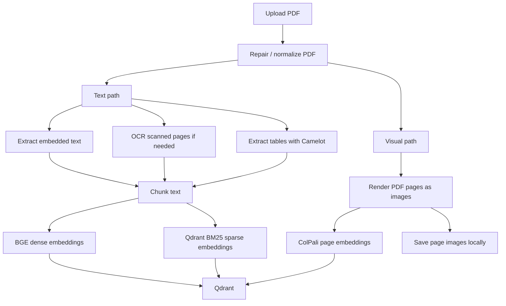
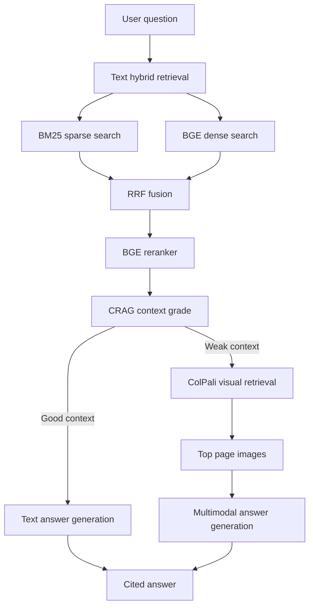

# Retriva

Retriva is an automatic hybrid document RAG system for PDFs. It can read normal
text PDFs, scanned PDFs, tables, and page layouts, then answer questions with
grounded citations.

The user experience is intentionally simple:

```text
Upload a PDF -> Ask a question -> Get a cited answer
```

Behind that simple flow, Retriva combines text retrieval, OCR, sparse BM25,
dense embeddings, reranking, CRAG-style self-correction, Ragas evaluation, and
ColPali visual page retrieval.

## What Retriva Can Do

| Capability | What it means |
| --- | --- |
| Text PDF ingestion | Extracts embedded text page by page with PyMuPDF. |
| Scanned PDF support | Uses page rendering plus Tesseract OCR when text is not embedded. |
| Table extraction | Uses Camelot and converts tables into markdown-like text. |
| Hybrid retrieval | Retrieves with Qdrant BM25 sparse vectors and BGE dense vectors. |
| RRF fusion | Combines sparse and dense ranked results with reciprocal rank fusion. |
| BGE reranking | Reranks candidate chunks before generation. |
| CRAG correction | Grades retrieved context and rewrites weak queries automatically. |
| Visual retrieval | Uses ColPali page-image embeddings for layout-heavy or scanned documents. |
| Multimodal answering | Sends retrieved page images to a multimodal OpenRouter model when visual evidence is needed. |
| Citation grounding | Keeps inline citations compact in chat and full sources in answer details. |
| Evaluation dashboard | Logs queries to SQLite and computes Ragas-style quality scores. |

## How It Works

### 1. Ingestion

When you upload a PDF, Retriva indexes it in two parallel ways.



Text chunks are stored in Qdrant with dense and sparse vectors. Visual pages are
stored in a separate Qdrant collection with ColPali multivectors. Rendered page
images are saved locally so the multimodal LLM can inspect the retrieved pages.

### 2. Querying

When the user asks a question, Retriva first tries the text pipeline. If the
retrieved text context is strong enough, it answers from text. If the context is
weak, it automatically falls back to visual retrieval.



The default text-grade threshold is configured by:

```env
AUTO_TEXT_GRADE_THRESHOLD=0.7
```

### 3. Answer Display

Retriva keeps the main chat clean.

In the chat bubble, citations are compact:

```text
Sanjay is the candidate named Chekka Sanjay Charan. [p. 1]
```

The full source filename, retrieval path, context grade, query rewrite, and
retrieved evidence are kept inside the collapsed `Answer details` panel.

## Project Structure

```text
retriva/
|-- backend/
|   |-- main.py                    # FastAPI app and automatic pipeline orchestration
|   |-- ingestion/                 # PDF parsing, OCR, tables, chunking
|   |-- retrieval/                 # Dense, sparse BM25, and fusion logic
|   |-- reranker/                  # BGE reranker
|   |-- correction/                # CRAG grading and query rewriting
|   |-- generation/                # Text and multimodal answer generation
|   |-- visual/                    # ColPali page retrieval
|   |-- evaluation/                # SQLite logging and Ragas evaluation
|   `-- db/                        # Qdrant setup and search helpers
|-- frontend/
|   |-- app.py                     # Streamlit multipage router
|   `-- pages/
|       |-- 0_Chatbot.py           # Upload and chat page
|       `-- 1_Evaluation.py        # Evaluation dashboard
|-- storage/visual_pages/          # Generated page images, ignored by git
|-- requirements.txt
|-- docker-compose.yml
`-- .env.example
```

## Main API Endpoints

| Endpoint | Purpose |
| --- | --- |
| `POST /ingest` | Upload one PDF and automatically build text plus visual indexes. |
| `POST /query` | Ask a question and get one cited answer from the best evidence path. |
| `GET /eval_logs` | Return logged queries and evaluation scores. |
| `POST /eval_logs/recompute` | Re-run pending evaluation scores in the background. |
| `POST /ingest_visual` | Debug endpoint for visual-only indexing. |
| `POST /query_visual` | Debug endpoint for visual comparison retrieval. |

## Setup

### 1. Create and activate a virtual environment

```powershell
python -m venv .venv
.\.venv\Scripts\Activate.ps1
```

### 2. Install dependencies

```powershell
uv pip install -r requirements.txt
```

If you are not using `uv`, regular pip also works:

```powershell
pip install -r requirements.txt
```

### 3. Configure environment variables

Copy the example file:

```powershell
Copy-Item .env.example .env
```

Set your Qdrant and LLM keys in `.env`.

Important defaults:

```env
EMBEDDING_MODEL=BAAI/bge-base-en-v1.5
EMBEDDING_VECTOR_SIZE=768
RERANKER_MODEL=BAAI/bge-reranker-v2-m3
COLPALI_MODEL=vidore/colpali-v1.2
MODEL_CACHE_DIR=.cache/models
AUTO_TEXT_GRADE_THRESHOLD=0.7
```

For OpenRouter:

```env
LLM_PROVIDER=openrouter
OPENROUTER_API_KEY=your_openrouter_key_here
OPENROUTER_MODEL=nvidia/nemotron-3-super-120b-a12b:free
VISUAL_OPENROUTER_MODEL=google/gemma-4-31b-it:free
```

You can use different OpenRouter models, but the visual model must support image
input if you want multimodal visual answering.

### 4. Start Qdrant

If you run Qdrant locally with Docker:

```powershell
docker run -p 6333:6333 -v ${PWD}\qdrant_data:/qdrant/storage qdrant/qdrant
```

Or use Qdrant Cloud and set:

```env
QDRANT_URL=https://your-qdrant-cloud-url
QDRANT_API_KEY=your_qdrant_api_key_here
```

### 5. Start backend

For normal development:

```powershell
uvicorn backend.main:app --reload --reload-dir backend
```

For faster testing when you are not editing backend files:

```powershell
uvicorn backend.main:app
```

Avoid plain `--reload` on the whole repository if you are working on frontend
files, because every reload clears the in-memory model cache and forces large
models to load again.

### 6. Start frontend

```powershell
streamlit run frontend/app.py
```

Open:

```text
http://localhost:8501
```

## Using The App

1. Upload a PDF in the sidebar.
2. Click `Ingest document`.
3. Ask a question in the chat input.
4. Read the answer.
5. Open `Answer details` if you want sources, retrieval metadata, or evidence.
6. Visit the `Evaluation` page to inspect logged questions and Ragas scores.

Try these prompts:

```text
Give me a concise summary of this document.
What are the key findings?
Who is mentioned in this document?
What scores or totals are shown?
Which pages support the answer?
```

## Evaluation

Retriva logs each query to SQLite through `backend/evaluation/logger.py`.

Each log row stores:

- question
- answer
- retrieved contexts
- CRAG context grade
- faithfulness
- answer relevancy
- context precision
- context recall

Ragas scores run in the background so the chat response stays fast. If scores
are pending, open the Evaluation page and click the recompute button.

## Model Cache And Latency

Downloaded models live under:

```text
.cache/models
```

This avoids re-downloading, but large models still need time to load into RAM
after a backend restart.

Common latency causes:

| Symptom | Reason | Fix |
| --- | --- | --- |
| ColPali loads for 40-60 seconds | Large model loading from disk into RAM/VRAM | Avoid unnecessary backend reloads. |
| Backend reloads after frontend edits | `uvicorn --reload` watches the whole repo | Use `--reload-dir backend`. |
| Slow answer generation | Free remote OpenRouter provider is slow or busy | Try another model or bring your own provider key. |
| First query is slower | Embedding/reranker models warm up on first use | Normal after restart. |

## System Requirements

Python dependencies are listed in `requirements.txt`.

Host tools:

- Tesseract OCR for scanned PDFs
- Ghostscript for some Camelot table extraction paths
- Docker if you run Qdrant locally

Optional:

- CUDA GPU for faster local model inference
- Hugging Face token to avoid unauthenticated model-download limits

```env
HF_TOKEN=your_huggingface_token_here
```

## Troubleshooting

### OpenRouter 429 rate limit

If you see:

```text
Error code: 429
temporarily rate-limited upstream
```

The model provider is rate-limiting the request. Retrieval may have worked, but
answer generation was blocked. Retry later, switch models, or add your own
provider key in OpenRouter integrations.

### PDF parser warnings

Some signed or malformed PDFs trigger PyMuPDF, pypdf, or Camelot warnings.
Retriva attempts to repair uploaded PDFs before ingestion and suppresses noisy
parser logs where possible.

### Existing Qdrant schema mismatch

If you changed vector names, model sizes, or collection settings, create a new
collection or temporarily set:

```env
QDRANT_RECREATE_COLLECTION=true
```

Then set it back to `false` after the collection is recreated.

## Design Principle

Retriva should feel simple to the user and sophisticated under the hood.

The user should not need to choose between OCR, dense retrieval, BM25, visual
retrieval, reranking, or self-correction. They upload any PDF, ask a question,
and Retriva chooses the best evidence path automatically.
