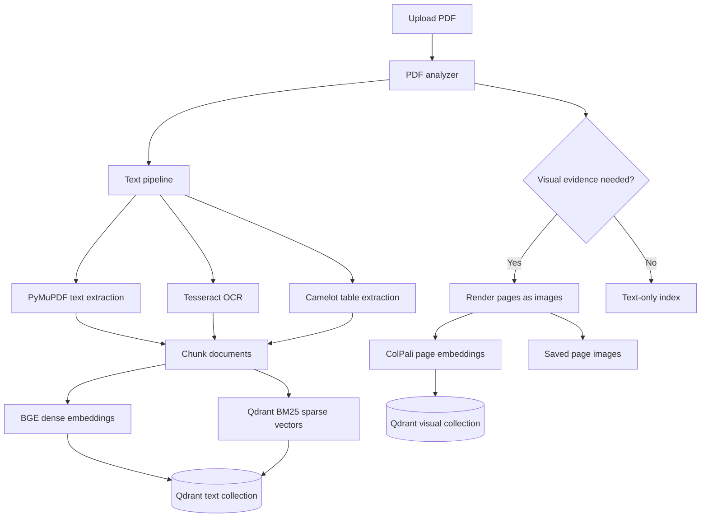
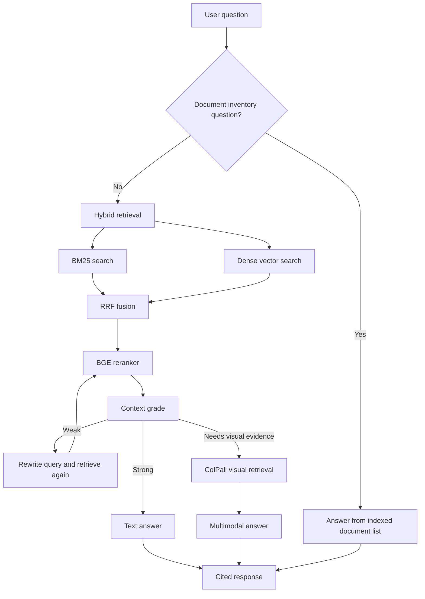

# Retriva

Retriva is a self-correcting hybrid document RAG system for PDFs.

It can ingest normal text PDFs, scanned PDFs, forms, tables, charts, and visual
page layouts, then answer questions with grounded citations. The system combines
text retrieval, sparse retrieval, visual retrieval, reranking, query correction,
and evaluation into one simple chat experience.

```text
Upload documents -> Retriva indexes evidence -> Ask questions -> Get cited answers
```

## Built With


Core technologies: `Python`, `FastAPI`, `Streamlit`, `Qdrant`, `PyMuPDF`,
`Tesseract OCR`, `Camelot`, `Sentence Transformers`, `FlagEmbedding`, `BGE`,
`ColPali`, `OpenRouter`, `Ragas`, and `SQLite`.

## Project Highlights

- Hybrid document retrieval with dense BGE embeddings and Qdrant BM25 sparse vectors.
- CRAG-style self-correction that grades retrieved context and rewrites weak queries.
- Automatic visual retrieval with ColPali for scanned, image-heavy, or layout-heavy PDFs.
- Multimodal answer generation for pages where the answer is visible in the layout.
- Citation-grounded answers with compact chat citations and detailed evidence on demand.
- Searchable Qdrant-backed document library in the Streamlit sidebar.
- Evaluation dashboard with Ragas-style faithfulness, relevancy, precision, and recall.
- FastAPI backend, Streamlit frontend, Qdrant vector database, and SQLite evaluation logs.

## What Makes It Different

Most PDF chat apps are built around clean text extraction. Retriva is designed
for real documents, where the answer may live in plain text, a table, a scanned
page, a form field, or a visual layout.

Retriva automatically chooses the best evidence path:

| Document Type | Retrieval Path |
| --- | --- |
| Clean text PDF | Text chunks, dense vectors, BM25 sparse vectors, reranking |
| Scanned PDF | OCR text plus visual page indexing |
| Tables | Table extraction converted into searchable markdown-like text |
| Forms and score cards | Visual page retrieval plus multimodal answer generation |
| Mixed reports | Hybrid retrieval with automatic visual fallback |

The user does not need to choose a mode. They upload a document and ask a
question.

## Product Experience

Retriva has two main pages:

| Page | Purpose |
| --- | --- |
| Chatbot | Upload PDFs, browse indexed documents, ask questions, and inspect evidence. |
| Evaluation | Review logged queries and quality metrics across answers. |

The chat interface keeps the answer readable. Technical metadata such as
retrieval path, context grade, query rewrite, source filenames, retrieved chunks,
and visual pages are available inside the collapsed `Answer details` panel.

## Core Capabilities

| Capability | Implementation |
| --- | --- |
| PDF parsing | PyMuPDF for embedded text and page metadata |
| OCR | Tesseract OCR for scanned pages |
| Table extraction | Camelot tables converted into text chunks |
| Text chunking | Simple overlapping character chunks |
| Dense retrieval | `BAAI/bge-base-en-v1.5` embeddings |
| Sparse retrieval | Qdrant FastEmbed BM25 sparse vectors |
| Fusion | Reciprocal rank fusion across dense and sparse results |
| Reranking | BGE reranker for final evidence selection |
| Self-correction | LLM context grading and query rewriting |
| Visual retrieval | ColPali page embeddings in a separate Qdrant collection |
| Generation | OpenRouter/OpenAI-compatible chat completion providers |
| Evaluation | SQLite query log with Ragas-style scoring |
| Frontend | Streamlit multipage app |
| Backend | FastAPI API service |

## Architecture





## How Retrieval Works

Retriva retrieves evidence through several stages:

1. Dense search finds semantically related chunks.
2. BM25 sparse search finds exact keyword and phrase matches.
3. Reciprocal rank fusion combines both ranked lists.
4. BGE reranking scores the strongest candidates against the question.
5. A context grader estimates whether the retrieved evidence is enough.
6. If needed, the query is rewritten and retrieval runs again.
7. If visual evidence exists and text evidence is weak, ColPali retrieves the
   most relevant pages.

This gives the system both semantic recall and keyword precision while still
being able to handle visual PDFs.

## Self-Correction Loop

Retriva includes a compact CRAG-style correction layer:

```text
retrieve -> rerank -> grade context -> rewrite if weak -> retrieve again
```

The correction layer is intentionally simple. It improves retrieval quality
without turning the project into a complicated agent framework.

## Visual Retrieval

For scanned documents, forms, score cards, and layout-heavy pages, text
extraction may not capture the full document meaning. Retriva uses ColPali to
embed PDF pages as visual evidence.

During ingestion, the PDF analyzer checks signals such as:

- text density per page
- embedded image area
- scanned or image-like pages
- drawing-heavy layouts

When visual indexing is useful, Retriva stores page-level visual embeddings in a
separate Qdrant collection and saves rendered page images for multimodal answer
generation.

## Evaluation Dashboard

Retriva logs each query and answer to SQLite, then computes evaluation scores in
the background. The dashboard tracks:

- faithfulness
- answer relevancy
- context precision
- context recall

This makes it easy to compare retrieval and generation quality as the system
evolves.

## Tech Stack

| Layer | Technology |
| --- | --- |
| Backend | FastAPI, Uvicorn, Pydantic |
| Frontend | Streamlit multipage app |
| Vector database | Qdrant dense and sparse collections |
| PDF processing | PyMuPDF, Pillow |
| OCR | Tesseract |
| Table extraction | Camelot |
| Dense retrieval | Sentence Transformers with BGE embeddings |
| Sparse retrieval | Qdrant FastEmbed BM25 |
| Rank fusion | Reciprocal rank fusion |
| Reranking | FlagEmbedding BGE reranker |
| Visual retrieval | ColPali page embeddings |
| LLM layer | OpenRouter and OpenAI-compatible clients |
| Evaluation | Ragas-style metrics, SQLite |
| Configuration | python-dotenv and `.env` |

## Project Structure

```text
retriva/
|-- backend/
|   |-- main.py
|   |-- correction/
|   |-- db/
|   |-- evaluation/
|   |-- generation/
|   |-- ingestion/
|   |-- reranker/
|   |-- retrieval/
|   `-- visual/
|-- frontend/
|   |-- app.py
|   `-- pages/
|       |-- 0_Chatbot.py
|       `-- 1_Evaluation.py
|-- storage/
|   `-- visual_pages/
|-- docker-compose.yml
|-- requirements.txt
|-- .env.example
|-- AGENTS.md
`-- README.md
```

## API Overview

| Endpoint | Method | Description |
| --- | --- | --- |
| `/ingest` | `POST` | Upload and index a PDF. |
| `/query` | `POST` | Ask a question and receive a cited answer. |
| `/documents` | `GET` | List indexed documents from Qdrant. |
| `/eval_logs` | `GET` | Read evaluation logs. |
| `/eval_logs/recompute` | `POST` | Recompute pending evaluation scores. |
| `/ingest_visual` | `POST` | Visual-only indexing endpoint for debugging. |
| `/query_visual` | `POST` | Visual comparison endpoint for debugging. |

Example query:

```json
{
  "question": "What are the key findings?"
}
```

Example response shape:

```json
{
  "answer": "The document states ... [Source: page 2, report.pdf]",
  "citations": [{"page": 2, "source": "report.pdf"}],
  "chunks": [],
  "visual_results": [],
  "answer_mode": "text_hybrid",
  "retrieval_summary": {
    "text_chunks": 5,
    "visual_pages": 0
  },
  "was_corrected": false,
  "grade_score": 0.92,
  "original_query": "What are the key findings?",
  "query_used": "What are the key findings?"
}
```

## Getting Started

### 1. Create a virtual environment

```powershell
python -m venv .venv
.\.venv\Scripts\Activate.ps1
```

### 2. Install dependencies

```powershell
uv pip install -r requirements.txt
```

### 3. Configure environment variables

```powershell
Copy-Item .env.example .env
```

Add your Qdrant and LLM provider keys:

```env
QDRANT_URL=https://your-qdrant-cloud-url
QDRANT_API_KEY=your_qdrant_api_key_here
QDRANT_COLLECTION_NAME=Retriva

LLM_PROVIDER=openrouter
OPENROUTER_API_KEY=your_openrouter_key_here
OPENROUTER_MODEL=nvidia/nemotron-3-nano-omni-30b-a3b-reasoning:free
```

### 4. Start the backend

```powershell
uvicorn backend.main:app
```

### 5. Start the frontend

```powershell
streamlit run frontend/app.py
```

Open:

```text
http://localhost:8501
```

## Useful Configuration

```env
EMBEDDING_MODEL=BAAI/bge-base-en-v1.5
EMBEDDING_VECTOR_SIZE=768
BM25_MODEL=qdrant/bm25

RERANKER_MODEL=BAAI/bge-reranker-base
RERANKER_USE_FP16=false

VISUAL_INDEX_MODE=auto
ENABLE_VISUAL_FALLBACK=true
COLPALI_MODEL=vidore/colpali-v1.2

ENABLE_CRAG=true
ENABLE_QUERY_REWRITE=true
CRAG_GRADE_THRESHOLD=0.7
```

## Demo Questions

After indexing a PDF, try:

```text
Summarize this document.
What are the key findings?
Which documents are indexed?
What values, scores, dates, or names are mentioned?
Which page supports this answer?
```

## Engineering Notes

Retriva keeps the core pipeline modular:

- ingestion logic is separate from retrieval
- correction is separate from generation
- evaluation is separate from the main answer path
- visual retrieval is isolated in `backend/visual/`
- all reusable prompt text lives in `backend/generation/prompt.py`

This makes the system easier to extend with new parsers, embedding models,
rerankers, vector databases, or LLM providers.

## Repository Notes

The project uses `.env` for runtime configuration and keeps generated artifacts
out of source control.

Common generated folders:

```text
.cache/models
storage/visual_pages
qdrant_data
backend/evaluation/eval_log.db
```

## License

This project is licensed under the terms in `LICENSE`.
